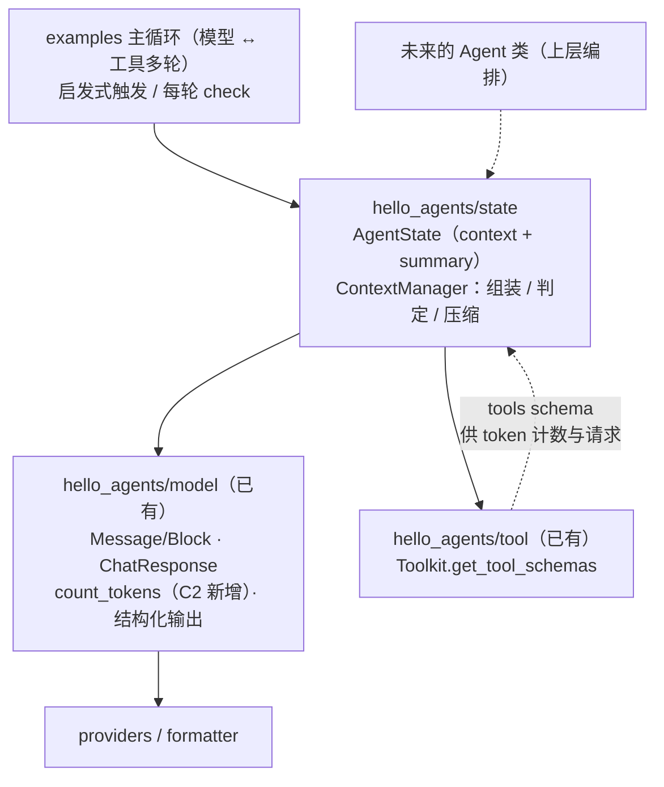

# Context 子系统学习总览：从零设计你 Agent 的上下文管理

> **学习方式**：对标 `D:\projects\agentscope\src\agentscope`（只读学习，不修改），
> 在 `D:\projects\hello-agents` 的**新栈**（`model/` + `tool/`）上，以**引导式**新建独立包 `hello_agents/state/`。
> 旧 `hello_agents/context/`（v1 遗留，建在 `core/`+`tools/`+`memory/` 上）按约定**不动、并存**。
>
> **节奏**：我交付图纸 → 你实现 → 我 review → 通过 → 下一任务。**每个任务一份文档**。

| 项 | 值 |
|---|---|
| 日期 | 2026-10-10 |
| 对标源码 | `src/agentscope/state/`、`src/agentscope/agent/`、`src/agentscope/message/`、`src/agentscope/formatter/`、`src/agentscope/model/_base.py` |
| 文档目录 | `docs/context/` |
| 前置 | 已完成 `hello_agents/model`（M0–M8）、`hello_agents/tool`（T0–T11）、薄桥接 `bridge/` |

---

## 1. 目标与边界

**目标**：吃透并亲手实现一套**会话上下文管理**——

- **会话状态对象**：`context`（未压缩历史）+ `summary`（压缩摘要）+ 会话/循环元数据；
- **上下文组装**：把「系统提示 + 摘要 + 历史」按固定顺序拼成模型输入；
- **token 估算**：为阈值判定提供依据（改造 `model/`：粗估兜底 + 可覆写）；
- **压缩**：阈值触发 → 切分（谁压、谁留）→ LLM 结构化摘要（5 字段）→ 回填；
- **异常路径**：保留比例过大、压缩输入本身超长、压缩过程被中断；
- **端到端**：在 examples 主循环里跑通「对话变长 → 触发压缩 → 摘要回填 → 继续对话」。

**不做**（重要，写在最前面）：

- **不做工具结果外置**（AgentScope 的 `Offloader` / `Workspace`，即第 ③ 块）——
  它挂着一整套 Workspace 抽象（local / docker / e2b / k8s），本轮整体裁剪；
  与之绑定的「单条工具结果超 `tool_result_limit` 的截断/外置」也一并裁剪（见 §7 裁剪表）。
- **不做 Agent 主循环**：按你既有约定，主循环只在 `examples/`，框架不内置。
- **不重写旧 `hello_agents/context/`**：并存，互不影响。
- **不做 middleware 体系**：AgentScope 的 `compress_context` 被 `on_compress_context` 中间件链包裹，
  你的新栈没有 middleware 层，本轮裁剪（如将来要加，钩子点已天然存在）。
- **不做多模态摘要**：`summary` 只按字符串处理（AgentScope 允许 `list[TextBlock|DataBlock]`，我们不复刻）。

---

## 2. 这层模块为什么值得单独做（不直接"截断历史"）

1. **上下文是 Agent 的能力上限**：截断会丢约束、丢决策依据、丢"我们试过什么"；
   压缩的目标是**有损但有结构**的信息降维。
2. **压缩必须是"约束输出"而不是"自由发挥"**：AgentScope 让模型**调用一个 schema 工具**产出
   5 个固定字段，而不是让它写一段散文——这是"可校验、可模板化、可回归测试"的前提。
3. **增长与缩短各只有一个出入口**：上下文只在 `save` 一处增长、只在 `compress` 一处缩短；
   否则根本说不清"上下文为什么变长了"。
4. **阈值判定 / 切分 / 摘要 是三件独立的事**：混在一起就无法单独测试——你旧
   `context/builder.py` 的教训（一次性塞进 `build()`，15 处缺陷堆叠、`build()` 跑不到结束）。
5. **状态归状态、协议归协议**：`state` 是可序列化对象，与厂商消息格式解耦（复用你 model 层已验证的分层）。

---

## 3. 架构



**依赖方向（硬约束）**：`state` → `model`、`state` → `tool`；**没有反向依赖**。
`state` 不 import `bridge`，也不 import `examples`。

---

## 4. 目录结构（计划）

```
hello_agents/state/
  __init__.py         中文模块 docstring +「典型用法：」+ 按字母序 __all__
  _state.py           AgentState：context / summary / session_id / reply_id / cur_iter
  _config.py          ContextConfig / SummarySchema（5 字段）
  _context.py         ContextManager：build_model_input / needs_compression / compress
  _split.py           切分算法（如 _context.py 行数超限再拆）
docs/context/         设计文档（本目录）
examples/state_*.py   演示与端到端
tests/test_state_*.py 测试
```

> 命名理由：AgentScope 把状态放在 `agentscope/state/`，压缩逻辑长在 `Agent` 身上。
> 我们**不自建 Agent 类**，所以把「状态 + 判定 + 压缩」都收进 `state/` 一个包——
> 它是**库**，谁触发、何时触发由上层决定（这是上一轮确认的边界）。

---

## 5. 任务路线（L1–L3 + C0–C7）

> **顺序原则**：先只读吃透原理与对比（L 系列，无代码）→ 再动手复刻（C 系列，有代码、有测试）。
> 每个任务一份文档；L 系列的"完成"= 你能复述/回答检查点；C 系列的"完成"= 代码 + 演示 + 测试通过。

| 任务 | 类型 | 主题 | 关键产物 | 文档 |
|---|---|---|---|---|
| **L1** | 只读 ✅ | 全貌与数据模型 | 讲解文档（已交付） | `01-agentscope-context-anatomy.md` |
| **L2** | 只读 | 压缩机制讲透 | 触发条件 / 切分算法 / 结构化摘要 / 回填 / 三条异常路径 | `02-agentscope-compression.md` |
| **L3** | 只读 | 设计决策与横向对比 | 与滑动窗口、RAG 长期记忆、Claude Code 式压缩、MemGPT 式的取舍 | `03-design-comparison.md`（后置，编号顺延） |
| **C0** | 动手 | 包骨架 + `AgentState` | `state/_state.py`、`__init__.py`、tests | `03-milestone-c0-state.md`（已交付） |
| **C1** | 动手 | 上下文组装 | 模块级 `build_model_input()`（三段式 + tools）+ `AgentState` 工具结果规则修订 | `04-milestone-c1-build-input.md`（已交付） |
| **C2** | 动手 | token 估算 | **改造 `model/`**：`count_tokens` 粗估 + 可覆写 | `06-milestone-c2-...` |
| **C3** | 动手 | 压缩入口与配置 | `ContextConfig` + `needs_compression` / `compress` 骨架与短路 | `07-milestone-c3-...` |
| **C4** | 动手 | 切分算法 | `_split.py`：保留预算回扫 + 边界消息按 block 切 + 不切断 tool_call/tool_result 配对 | `08-milestone-c4-...` |
| **C5** | 动手 | 结构化摘要 | 5 字段 `SummarySchema` + 复用 model 结构化输出 + 模板拼装 | `09-milestone-c5-...` |
| **C6** | 动手 | 回填与异常路径 | 状态替换 + reserve 过大 / 输入超长 / 中断保护 | `10-milestone-c6-...` |
| **C7** | 动手 | 端到端整合 | examples 跑通「压爆 → 压缩 → 继续」+ 复盘 | `11-milestone-c7-...` |

**C2 的分工特例**：按上一轮约定，`model/` 的改造由**我动手**，其余（`state/` 包、examples、tests）由你亲手写。

---

## 6. 协作约定（沿用 model / tool 阶段）

- **我交付**：讲解文档、设计图纸（设计原理 → 接口契约含完整代码 → 留给你的动手任务 → 边界与裁剪 → 验收清单 → agentscope 源码对照）、review；
- **你负责**：`hello_agents/state/`、`examples/`、`tests/` 的代码（亲手写）；
  **例外**：`model/` 的改造由我动手；
- **只读对标** agentscope，不修改它；旧 `hello_agents/context/` 不动；
- 每个任务做最小自检 + ruff：

```powershell
uv run ruff check hello_agents/state examples/state_*.py tests/test_state_*.py
uv run ruff format --check hello_agents/state examples/state_*.py tests/test_state_*.py
uv run pytest tests/test_state_*.py -q
```

- 能用**假模型 / 离线**测的就不依赖真实网络（压缩的关键是"切分与回填"，摘要调一次模型即可用桩替身）；
- 环境：Python 3.13、uv、`.venv`。

---

## 7. 裁剪表（与 AgentScope 的差异，逐条记账）

| AgentScope 能力 | 本轮 | 理由 |
|---|---|---|
| `AgentState.permission_context` / `tasks_context` / `middle_context` | 裁剪 | 属于其它子系统；我们只保留 `context` / `summary` / 会话与循环元数据 |
| `AgentState.tool_context`（读文件缓存、激活组） | 裁剪 | 与工具层耦合；压缩时"联动清理缓存"的必要性随之消失 |
| 工具结果外置 `Offloader` / `Workspace`（③） | 裁剪 | 按约定只做 ①② |
| 单条工具结果超 `tool_result_limit` 的截断/外置 | 裁剪 | 与 ③ 绑定；如将来要单做，可加任务 C8 |
| `on_compress_context` 中间件链 | 裁剪 | 新栈无 middleware 层 |
| 多模态摘要块（`DataBlock`） | 裁剪 | 摘要只按字符串处理 |
| `count_tokens` 的精确 tokenizer | 裁剪（留接口） | 只做粗估 + 可覆写；真要精确再接 tiktoken |
| 压缩摘要的 5 字段 + 结构化工具调用 | **保留** | 这是 ② 的核心 |
| 切分算法（含不切断工具调用/结果配对） | **保留** | 这是 ② 的核心 |

---

## 8. 完成标准

- 能**闭卷**讲清：三段式组装顺序、压缩触发点、切分算法的边界处理、结构化摘要 5 字段、三条异常路径；
- 能说清「为什么压缩要用结构化输出」「为什么切分不能切断 tool_call/tool_result 配对」；
- `examples` 里跑通一次真实压缩：对话变长 → 触发 → `summary` 生成 → `context` 变短 → 继续对话不崩；
- 能对比主流做法（滑动窗口 / RAG 长期记忆 / Claude Code 式压缩）的取舍，并说出你的模块选了哪条路、为什么；
- 旧 `hello_agents/context/` 与既有 model/tool 测试**零回归**。

---

## 待你确认

1. **任务划分与顺序**（L1–L3 + C0–C7）是否合适？要合并/拆分/调整顺序，直接指出；
2. **文档命名**（`docs/context/NN-*.md`）与**包名**（`hello_agents/state/`）是否认可；
3. 确认后，我立即交付 **C0 图纸**（包骨架 + `AgentState`），并同时把 **L2（压缩机制讲透）** 排到前面交付
   ——因为 C3/C4/C5 的实现必须建立在 L2 的理解之上。