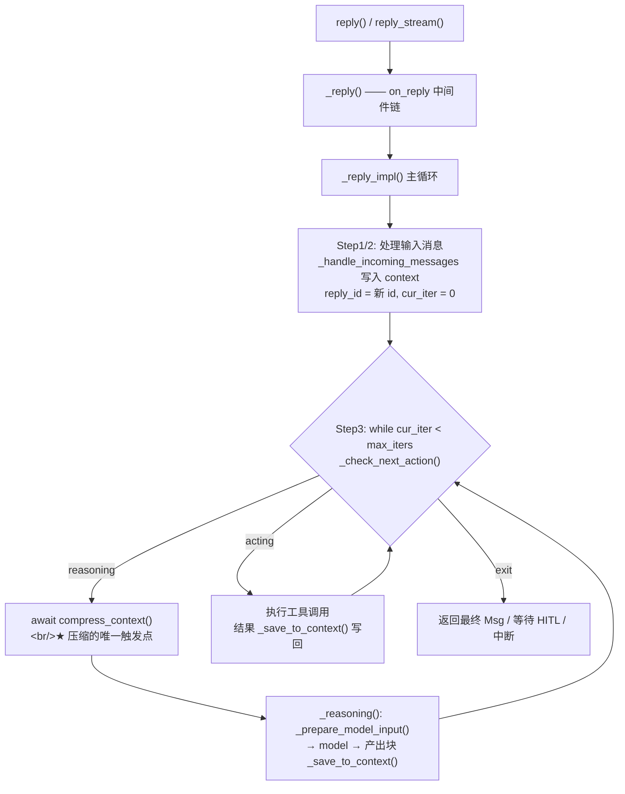

# 第一章：AgentScope 上下文管理的全貌与数据模型

> **学习方式**：对标 `D:\projects\agentscope\src\agentscope`（只读学习，不修改）。
> **最终目标**：在 `D:\projects\hello-agents` 的新栈（`model/` + `tool/`）上，复刻 AgentScope 的
> **会话上下文管理**——按约定只做「① 会话状态 + ② LLM 结构化摘要压缩」两条主线，
> 不做「③ 工具结果外置（Offloader / Workspace）」。
>
> **本系列章节**：第一章 全貌与数据模型（本文）→ 第二章 压缩机制 → 第三章 设计决策与横向对比
> → 第四章起 复刻图纸（里程碑，格式对标 `docs/tool/`）。

| 项 | 值 |
|---|---|
| 日期 | 2026-10-10 |
| 对标源码 | `src/agentscope/state/`、`src/agentscope/agent/`、`src/agentscope/message/`、`src/agentscope/formatter/`、`src/agentscope/model/_base.py` |
| 本文范围 | 「上下文是什么、存在哪、谁在改它」；不含压缩算法细节与方案对比 |
| 前置 | 已完成 `hello_agents/model`（M0–M8）与 `hello_agents/tool`（T0–T11） |

---

## 1. 一句话定义

在 AgentScope 里，**每一轮模型看到的东西**由 `_prepare_model_input()`（`src/agentscope/agent/_agent.py:2280`）拼装，
只有四样东西，顺序固定：

```python
# src/agentscope/agent/_agent.py:2280（节选）
messages = [
    SystemMsg(name="system", content=await self._get_system_prompt()),  # ① 动态系统提示
]
if self.state.summary:                                                  # ② 压缩摘要（可选）
    messages.append(UserMsg(name="user", content=self.state.summary))
messages.extend(self.state.context)                                     # ③ 未压缩的对话历史
tools = await self.toolkit.get_tool_schemas(...)                        # ④ 工具 schema（不属于上下文）

return {"messages": messages, "tools": tools}
```

于是：

> **上下文 = 系统提示 + 历史摘要 + 未压缩历史**

- ① 是**每轮现算**的：基础 `system_prompt` + skill 指令 + offloader 指令，最后过一遍
  `on_system_prompt` 中间件链（`_agent.py:2255`）。
- ② `summary` 是「已被压缩掉的那段历史的替身」，**只有非空时才插入**。
- ③ `state.context` 是 `list[Msg]`，原样展开。
- ④ 工具 schema 与上下文并列，不属于「上下文管理」的范畴。

**压缩的本质**：`context` 变短、`summary` 变长，两者总 token 下降，但语义不丢。

---

## 2. 数据模型：`AgentState` 是唯一真相源

`AgentState`（`src/agentscope/state/_state.py:149`）是一个 pydantic 模型，其 docstring 写得很直白：

> `"""The agent state that should be saved and loaded from storage."""`

| 字段 | 类型 | 作用 |
|---|---|---|
| `session_id` | `str` | 会话标识，一个会话一份状态 |
| `summary` | `str \| list[TextBlock \| DataBlock]` | **压缩摘要**，默认字符串 |
| `context` | `list[Msg]` | **未压缩的对话历史** |
| `reply_id` | `str` | 当前这次 reply 的 id，**同时也是最终那条消息的 id** |
| `cur_iter` | `int` | ReAct 循环轮次（上限 `react_config.max_iters`，默认 20） |
| `permission_context` | `PermissionContext` | 权限子系统挂靠 |
| `tool_context` | `ToolContext` | 读文件缓存、激活的工具组，工具子系统挂靠 |
| `tasks_context` | `TaskContext` | 任务子系统挂靠 |
| `middle_context` | `dict[str, Any]` | 中间件跨轮存数据 |

三个观察：

1. **真正属于「上下文管理」的只有 `summary` + `context`**；其余四个字段是别的子系统「挂靠」在同一个对象上。
2. 这么设计的收益是**整块状态可一次性序列化/恢复/注入**（持久化、断点续跑、测试里直接构造状态）；
   代价是 state 变成"大杂烩"，任何写 state 的地方都要小心别踩到别人的字段。
3. 后续会看到一个佐证：压缩只该动 `summary` + `context`，但**必须联动** `tool_context`
   —— 被压掉的 `Read` 调用对应的文件缓存要清掉（`_clear_unreserved_read_cache`，`_agent.py:2078`）。

---

## 3. 消息与块：**存储形态**与**协议形态**是分开的

### 3.1 两个类型

```python
# src/agentscope/message/_base.py:66（节选）
class Msg(BaseModel):
    name: str
    content: list[ContentBlock]
    role: Literal["user", "assistant", "system"]
    id: str
    metadata: dict
    created_at: str
    finished_at: str | None
    usage: Usage | None      # 该消息的 token 用量
```

`Block` 共六种：`TextBlock`、`ThinkingBlock`、`ToolCallBlock`、`ToolResultBlock`、`DataBlock`、`HintBlock`
（`src/agentscope/message/_block.py`）。`role` 对可放块类型有约束（`validate_role_content`）。

**为什么不是 `role + 字符串`**：一次 assistant 回复可能**同时**包含思考、正文与多个工具调用；
工具结果又必须以独立语义回灌。字符串塞不下这种结构。这一点与你 `hello_agents/model` 的判断一致，
不再展开。

### 3.2 关键设计：工具调用与工具结果**聚合在同一条 assistant 消息**里

AgentScope 在**存储层**把工具调用和工具结果都写进同一条 assistant `Msg` 的 `content`：

```python
# 模型产出后（在 _reasoning_impl 内）
self._save_to_context(blocks, usage)                        # _agent.py:1085

# 工具执行后
self._save_to_context([reserved_tool_result_block])         # _agent.py:1788
```

`_save_to_context` 的聚合逻辑（`_agent.py:2459`）：若 `state.context` 最后一条是「本 agent、同 `reply_id`
的 assistant 消息」，就把新块 **append 进去**；否则新建一条。结果是：

> **一次 reply == 一条 assistant 消息**（消息 `id` 就是 `state.reply_id`）。

那么协议要求的 `assistant(tool_calls)` + `role=tool` 消息对在哪产生？在 **formatter**：

- OpenAI 系：展开成 `assistant(tool_calls)` + `role=tool` 消息；
- Anthropic：`tool_result` 必须放进 **`user`** 消息（`src/agentscope/formatter/_anthropic_formatter.py:246`）。

**与 `hello_agents` 的分歧点**：你的 `bridge` 把 `ToolResultBlock` 转成**独立的 `role=tool` 消息**回灌，
即「存储即协议形态」；AgentScope 是「**存储聚合、出网展开**」。

| | AgentScope（聚合存储） | hello_agents（独立 tool 消息） |
|---|---|---|
| 消息粒度 | 一次 reply 一条消息，`reply_id` 严格一对一 | 一次工具调用一条消息 |
| 事件对齐 | 天然对齐（事件带 `reply_id`） | 靠 `tool_call_id` 配对 |
| 代价 | 计数/序列化/切分都要**走进块内部** | 需要一个 bridge 做双向转换 |
| 好处 | 与任何厂商协议解耦，换协议只改 formatter | 与 OpenAI 协议同构，转换轻 |

> 两种都成立。这个取舍会在**第三章**与你的项目正面对比。

---

## 4. 一次 reply 里，上下文的完整生命周期

主循环在 `_reply_impl()`（`_agent.py:664`）：



要点：

- **新回复**：输入消息经 `_handle_incoming_messages`（`_agent.py:1308`）写入 `state.context`；
  随后 `reply_id` 换新、`cur_iter` 归零。
- **每轮**：`_check_next_action()`（`_agent.py:2542`）判定三态 `reasoning` / `acting` / `exit`。
- **压缩的唯一触发点**：进入 `reasoning` 之前执行 `await self.compress_context()`。
- **上下文只在一处增长**：`_save_to_context`（模型产出 + 工具结果都走它）。
- **上下文只在一处缩短**：`compress_context`。

> **最值得抄走的设计原则：收口。**
> 在 AgentScope 里，回答「上下文为什么变长了」只需看一个方法；回答「为什么变短了」只需看一个函数。
> 这种「增长与缩短各自只有一个出入口」的结构，是后续可测试、可审计、可替换策略的前提。

---

## 5. 对外只有三个入口

| 入口 | 位置 | 职责 |
|---|---|---|
| `observe(msgs)` | `_agent.py:266` | 把外部观察消息写入上下文（不触发模型调用） |
| `reply()` / `reply_stream()` | `_agent.py:225` / `:194` | 触发一轮，进入 ReAct 循环 |
| `compress_context()` | `_agent.py:271` | 显式压缩；被 `on_compress_context` 中间件链包裹 |

另外，`state` 可以从构造函数注入（`Agent(..., state=...)`，`_agent.py:100`），
因此状态可持久化、可在测试中直接断言。

---

## 6. 与 `hello_agents` 现状的对照

| 能力 | AgentScope | hello_agents 现状 | 复刻要做的事 |
|---|---|---|---|
| 统一消息模型 | `Msg` + 6 种 Block | `Message` + Block（等价） | 基本复用 |
| token 用量 | `Msg.usage` / `ChatUsage` | `ChatUsage` | 基本复用 |
| 会话状态对象 | `AgentState`（`context` + `summary`） | **无** | 新建 |
| 上下文组装 | `_prepare_model_input()` | **无**（主循环在 `examples/agent_t11.py`） | 新建，只提供"组装"能力 |
| token 估算 | `ChatModelBase.count_tokens()`，默认**字节数 / 4**，可覆写 | **无**（只有 `ModelCard.context_size`） | 改造 `model/`：加粗估 + 可覆盖接口 |
| 压缩 | `compress_context()`（LLM 结构化摘要） | **无** | 第二章设计 |
| 工具结果外置 | `Offloader` / `Workspace` | **无** | **不做**（按约定裁剪） |

**关于「超阈值怎么判断」的回答**：AgentScope 的 `count_tokens()`
（`src/agentscope/model/_base.py:350`）默认实现是「输入总字节数 / 4」的**粗估**，docstring 明说
"要精确就 override，把消息格式化后用底层 API 的 tokenizer 数"。即：

> **粗估兜底 + 留可覆盖接口**，而不是一开始就绑死 `tiktoken`。

这直接决定了 `model/` 改造的形状，也解释了你原 `hello_agents/context/builder.py` 里
`tiktoken` 与中英文字符启发式「两套 token 口径混用」为什么会出问题。
---

## 7. 本章关键设计决策小结

| # | 结论 | 为什么 |
|---|---|---|
| D1 | 上下文 = 系统提示 + 摘要 + 未压缩历史，顺序固定 | 模型对 system / 头部信息更敏感；摘要放前面才有"我继承了一段历史"的语义；历史保持时间序 |
| D2 | 状态集中在 `AgentState`，压缩只动 `summary` + `context` | 一处持久化、一处恢复；但需注意联动清理挂靠字段（读文件缓存） |
| D3 | 存储层把 block 聚合进 assistant 消息，协议形态交给 formatter | 存储与厂商协议彻底解耦，换协议只改一个模块 |
| D4 | 上下文增长只有 `_save_to_context` 一个口，缩短只有 `compress_context` 一个口 | 收口；可审计、可测试、可替换 |
| D5 | 压缩在 reasoning 之前触发 | 保证"下一次发给模型"的一定在预算内；而不是事后补救 |
| D6 | token 计数用粗估 + 可覆写 | 不同模型 tokenizer 不同，框架不该绑死某一家的实现 |

---

## 8. 检查点（请先复述/提问，再进入第二章）

1. 用你自己的话说：一轮 reply 里，模型收到的 messages 由哪几段、按什么顺序拼成？
   `summary` 落在哪一段、用的什么 role？为什么是 user 而不是 system？
2. 为什么 AgentScope 把工具结果存进 assistant 消息，而不是独立的 `role=tool` 消息？
   结合你 `bridge` 的做法，说说两种方案的取舍。
3. `AgentState` 为什么把权限、工具缓存、任务、中间件数据都塞进同一个对象？
   这对"上下文管理"是帮助还是负担？
4. 压缩为什么选在"reasoning 之前"触发，而不是"每轮 reply 结束后"或"模型报错时"？

---

## 附：本章源码索引

| 位置 | 内容 |
|---|---|
| `src/agentscope/state/_state.py:149` | `AgentState` |
| `src/agentscope/state/_state.py:194` | `append_context`（按 `reply_id` 聚合） |
| `src/agentscope/message/_base.py:66` | `Msg` |
| `src/agentscope/message/_block.py` | 六种 Block |
| `src/agentscope/agent/_agent.py:100` | `Agent.__init__`（可注入 `state`） |
| `src/agentscope/agent/_agent.py:271` | `compress_context`（中间件链） |
| `src/agentscope/agent/_agent.py:664` | `_reply_impl`（主循环） |
| `src/agentscope/agent/_agent.py:1085` | 模型产出块写入上下文 |
| `src/agentscope/agent/_agent.py:1788` | 工具结果写入上下文 |
| `src/agentscope/agent/_agent.py:2255` | `_get_system_prompt` |
| `src/agentscope/agent/_agent.py:2280` | `_prepare_model_input` |
| `src/agentscope/agent/_agent.py:2459` | `_save_to_context`（唯一增长口） |
| `src/agentscope/agent/_agent.py:2542` | `_check_next_action`（三态判定） |
| `src/agentscope/model/_base.py:57` | `ChatModelBase.context_size` |
| `src/agentscope/model/_base.py:350` | `count_tokens`（默认粗估） |
| `src/agentscope/model/_base.py:438` | `generate_structured_output`（供压缩使用） |
| `src/agentscope/formatter/_anthropic_formatter.py:246` | `tool_result` → `user` 消息 |