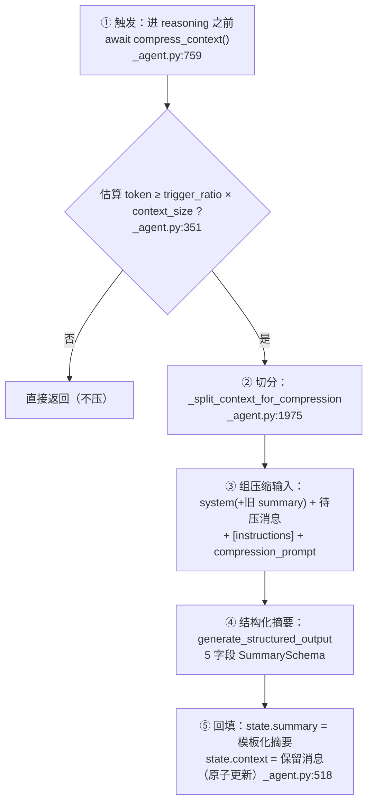

# 第二章：压缩机制讲透（何时压 · 压谁留谁 · 摘要怎么产 · 怎么回填 · 出错怎么办）

> **目标**：把 AgentScope 上下文压缩的完整链路讲透——每一步的输入、输出、决策依据与失败处理。
> **对标（只读）**：`src/agentscope/agent/_agent.py`（`compress_context` 及其私有实现、`_split_context_for_compression`）、
> `src/agentscope/agent/_config.py`（`ContextConfig` / `SummarySchema`）、`src/agentscope/model/_base.py`（`count_tokens` / `generate_structured_output`）。
> **本章只讲原理，不要求写代码**；文末有检查点，你能复述即可进入 C0。

---

## 2.1 全景：一条五步链路



| 步骤 | 位置 | 一句话 |
|---|---|---|
| ① 触发 | `_agent.py:759` / `:327` | 进 `reasoning` 之前调用；按 `trigger_ratio × context_size` 判定 |
| ② 切分 | `_agent.py:1975` | 从尾部往前凑够 `reserve_ratio × context_size`，其余进压缩区 |
| ③ 组输入 | `_agent.py:412` | 「system + 旧摘要 + 待压消息 + 压缩指令」 |
| ④ 摘要 | `_agent.py:441` | 让模型**调用 schema 工具**产出 5 个字段 |
| ⑤ 回填 | `_agent.py:518` | 模板化后写回 `summary`，`context` 换成保留区；**原子** |

---

## 2.2 第一步：触发——什么时候压

**唯一触发点**在主循环里（`_reply_impl`，`_agent.py:758`）：

```python
if action == "reasoning":
    # Compressed the memory if needed before reasoning
    await self.compress_context()        # _agent.py:759
```

即：**每次要请求模型之前**先检查一次。判定逻辑在 `_compress_context_impl`（`_agent.py:327`）：

```python
cfg = context_config or self.context_config
kwargs = await self._prepare_model_input()          # 当前完整输入
estimated_tokens = await self.model.count_tokens(**kwargs)

threshold = cfg.trigger_ratio * self.model.context_size        # 默认 0.8 × context_size
if estimated_tokens < threshold:
    return                                          # 没到阈值，直接返回

if len(self.state.context) == 0:                    # 系统提示 (+摘要) 自己就超了
    raise RuntimeError("... cannot be compressed.")  # 开发者配置问题，大声报错
```

三个要点：

1. **判定用的是"当前真实模型输入"**（`_prepare_model_input()`），不是"context 的长度"——
   因为 `tools` schema 也占 token，必须一起算。
2. `trigger_ratio` 上限被约束为 `< 0.9`（`_config.py:56`），**刻意留出 10% 余量**给压缩那一次调用
   ——压缩本身也要一轮模型请求，不能把窗口占满。
3. 「系统提示 + 摘要」放不下时**不可压**（它们是常量骨架），只能报错；
   这和你旧 `hello_agents/context/builder.py` 里"配置校验用 assert，`python -O` 下被剥离"形成对照：
   **不可恢复的情形要 raise，不要静默降级**。

---

## 2.3 第二步：切分——压谁、留谁（本章核心）

预算：`to_reserved_tokens = reserve_ratio × context_size`（默认 `0.1 × context_size`）。
目标：**尾部留够约 10%，其余全部进压缩区**。算法分两层。

### 2.3.1 第一层：消息级（从尾往前累计 token）

```python
# _agent.py:1975 节选
system_msg = [SystemMsg(name="system", content=await self._get_system_prompt())]
if self.state.summary:
    system_msg.append(UserMsg("user", self.state.summary))      # 旧摘要也参与计数

msg_index = len(self.state.context) - 1
while msg_index >= 0:
    reserved_tokens = await self.model.count_tokens(
        system_msg + self.state.context[msg_index:], tools)
    if reserved_tokens >= to_reserved_tokens:
        break
    msg_index -= 1

if msg_index < 0:
    return [], deepcopy(self.state.context)                      # 全放得下 → 没有可压的

msgs_to_compress = self.state.context[:msg_index]
msgs_to_reserve  = self.state.context[msg_index + 1 :]
boundary_msg     = self.state.context[msg_index]                 # 边界消息（可能被切开）
```

要点：

- **按 token 累计，不按消息条数**：同样 5 条消息，可能 200 token 也可能 20000 token；
  只有"从尾往前的累计 token"才保证进预算。
- 循环是**从后往前**的，所以保留的永远是"最近的对话"——这是上下文管理的默认假设：
  **越近的越重要**（第三章会对比"不这么假设"的做法）。
- 它**每轮都重新 count 一次**（O(n²) 次计数），换来的是实现简单 + 绝对满足预算；
  AgentScope 选择接受这个成本（`count_tokens` 是粗估、很便宜）。
- 返回 `deepcopy`：**压缩过程绝不能就地改 `state.context`**，因为后面任一步失败，状态都必须保持原样。

### 2.3.2 第二层：block 级（因为"一次 reply 只有一条消息"）

承接第一章 D3：AgentScope 把一次 reply 的思考、正文、工具调用、工具结果**聚合在同一条 assistant 消息**里。
所以边界消息可能又长又混合，必须**按 block 再切一次**：

```python
# _agent.py:1998 节选
block_index = len(boundary_msg_content) - 1
while block_index >= 0:
    attempt_msg.content = boundary_msg_content[block_index:]     # 只取尾部后缀
    try_reserved = system_msg + [attempt_msg] + msgs_to_reserve
    if await self.model.count_tokens(try_reserved, tools) > to_reserved_tokens:
        break
    block_index -= 1
```

即：从**最后一个 block 往前**逐块扩大保留后缀，直到超预算为止。

### 2.3.3 配对修正：绝不让 `tool_result` 与它的 `tool_call` 分离

```python
# _agent.py:2020 节选：扫描"保留区"里有没有配不上对的工具结果
remain_result_ids = {}
for i in range(len(boundary_msg_content) - 1, block_index, -1):
    block = boundary_msg_content[i]
    if isinstance(block, ToolResultBlock):
        remain_result_ids[block.id] = i           # 先记下结果
    elif isinstance(block, ToolCallBlock):
        remain_result_ids.pop(block.id, None)     # 后来遇到对应的调用 → 配对成功

if remain_result_ids:                              # 剩下的是"孤儿结果"
    block_index = max(remain_result_ids.values())  # 把 block_index 下移到最大孤儿处
```

语义：**如果一个工具结果被留在保留区、但它的工具调用被切进了压缩区，就把这个结果也一并压走。**

不修会怎样（两个方向都错）：

- **协议侧**：formatter 把保留区展开成 `assistant(tool_calls)` + `role=tool` 时，
  会出现一个**没有对应调用**的工具结果 → 厂商 API 直接报错。
- **语义侧**：模型会看到"一个没人请求过的工具输出"，轻则困惑，重则幻觉出一次并不存在的调用。

> 注：配对扫描依赖「调用在前、结果在后」的顺序——这正是 `_save_to_context` 先写模型产出、
> 执行完再 append 工具结果所保证的（第一章 §3.2）。

最后按 `block_index` 切开；空的一半不加入结果：

```python
boundary_msg_to_compress.content = boundary_msg_content[: block_index + 1]
boundary_msg_to_reserve.content  = boundary_msg_content[block_index + 1 :]
```

### 2.3.4 两种边界情况

| 情况 | 现象 | 处理 |
|---|---|---|
| 整个 context 都放进保留区 | 返回 `([], context)`，压缩区为空 | 上层兜底：**把保留预算降到 0 重切一次**（`_agent.py:386`，带 warning） |
| 保留区预算太大导致压缩区为空 | 同上 | 同上（这条正是"`reserve_ratio` 配大了"的典型症状） |

顺带一个实现细节（不必抄）：外层循环用 `>=` 判停，内层用 `>`，两者不对称——**写作时你自己定一个口径并保持统一**，
否则边界测试会出现"差 1 token"的玄学失败。

---

## 2.4 第三步：组压缩输入——喂给摘要模型什么

```python
# _agent.py:412 节选
messages = (
    msgs_system                       # ① system prompt + 旧 summary（若存在）
    + msgs_to_compress                # ② 即将被压掉的消息
    + instruction_msgs                # ③ 可选的 HintBlock（以 AssistantMsg 注入）
    + [UserMsg(name="user", content=cfg.compression_prompt)]   # ④ 压缩指令
)
```

三个设计点：

1. **旧 `summary` 也一起喂进去**（`msgs_system.append(UserMsg("user", self.state.summary))`）。
   否则每压一次就只总结"这一段"，上一次的结论会被永久丢掉——**摘要必须是迭代累积的**，
   而不是"替换式遗忘"。
2. **`instructions` 是可选的口子**：调用方可以用 `HintBlock` 影响摘要的关注点
   （例如"重点保留文件路径与未决问题"），公共方法 `compress_context(instructions=...)` 暴露了它。
3. 压缩指令是 `compression_prompt`（`_config.py:71`），内容是一句 `<system-hint>`：
   *"你还没做完任务，现在写一份续作摘要，让未来的你在新窗口里能高效接手"*——**以用户消息注入**，
   而不是塞进 system，避免污染系统身份设定。

组好之后先估算一次：若 `> model.context_size`，打 warning 并置 `context_overflow = True`（留给失败路径用）。

---

## 2.5 第四步：结构化摘要——怎么让模型输出靠谱

```python
# _agent.py:441 节选
res = await self.model.generate_structured_output(
    messages=messages,
    structured_model=cfg.summary_schema,        # = SummarySchema.model_json_schema()
)
```

`SummarySchema`（`_config.py:9`）规定 5 个字段，每个字段的 description 就是在**指挥模型该保留什么**：

| 字段 | 它在防什么（取自源码 description） |
|---|---|
| `task_overview` | 防"忘了用户到底要什么/成功标准是什么" |
| `current_state` | 防"忘了已经做到哪、产出了什么（含文件路径）" |
| `important_discoveries` | 防"忘了踩过的坑、做过的决策及理由、试过但不行的方案" |
| `next_steps` | 防"忘了下一步做什么、卡在哪、优先级" |
| `context_to_preserve` | 防"忘了用户偏好、领域常识、做过的承诺" |

**为什么不直接让模型"写一段摘要"**：一段自由文本无法校验、无法回归测试、也无法保证每次都覆盖上面 5 类信息。
用 schema 约束后：

- "该保留什么"从**模型的自发行为**变成**接口约定**；
- 产出是**结构化的**，可以模板化拼回上下文、可以单测断言字段是否齐全；
- 换模型/换语言时，契约不变。

> 一个容易看漏的细节：代码里还构造了 `compression_tool_schema`（一个名为 `generate_structured_output`
> 的 function schema），但它**只用于 token 计数**（`_agent.py:432`），并不参与这次实际调用。
> 你自己实现时可以把这步简化掉，但要知道它为什么在：**估算输入大小时必须把"结构化工具的定义"也算进去**。

---

## 2.6 第五步：回填——怎么把结果装回去

```python
# _agent.py:518 节选
async def _apply_change() -> None:
    new_summary = cfg.summary_template.format(**res.content)   # 套模板成 <system-info>…</system-info>
    ...
    self.state.summary = new_summary      # ① 摘要变长
    self.state.context = msgs_to_reserve  # ② 历史变短

apply_task = asyncio.create_task(_apply_change())
try:
    await asyncio.shield(apply_task)
except asyncio.CancelledError:
    await apply_task                       # 被取消也要等它做完
    raise
```

两个设计点：

1. **模板化而不是塞原文**：`summary_template`（`_config.py:88`）把 5 个字段拼成带小标题的
   `<system-info>` 文本块。这样摘要**每次回填的形状都一样**，模型不会因为格式漂移而困惑；
   也方便你以后调格式（改模板不改逻辑）。
2. **更新必须原子**：`summary` 与 `context` 是**一对必须同进同退**的状态。
   若在两者之间被取消，就会出现"摘要说已经总结了，但历史还在（或被删了但摘要没写）"的错乱状态——
   这是最难查的一类 bug。`asyncio.shield` + "取消后仍 await 完成再抛"就是为它准备的。

> AgentScope 在这里还做了 `offloader.offload_context(...)` 与 `_clear_unreserved_read_cache(...)`
> （工具结果落盘 + 读缓存联动清理）——按约定这两块**我们裁剪**，但你要理解它属于"回填的附带动作"，
> 所以放在同一个原子块里。

---

## 2.7 三条异常路径：出错怎么办

| # | 场景 | 触发条件 | 处理 | 位置 |
|---|---|---|---|---|
| E1 | **保留比例过大** | 切分后压缩区为空（阈值已超，却"没东西可压"） | warning + 把保留预算降到 `0` 重切一次 | `_agent.py:386` |
| E2 | **压缩输入本身超长** | 首次 `generate_structured_output` 抛异常 **且** `context_overflow=True` | 从最旧的待压消息开始逐条丢弃，直到估算 `< context_size × trigger_ratio`，再调一次 | `_agent.py:463` |
| E3 | **压缩过程被中断** | `res.finished_reason == INTERRUPTED` | 抛 `asyncio.CancelledError`（**不吞**） | `_agent.py:508` |
| E4 | **骨架自身超阈值** | `len(state.context) == 0` 且已超阈值 | `RuntimeError`（不可压，交给开发者） | `_agent.py:360` |

关键区分：**E3 必须让取消传播**（和你 model 层 M5 的结论一致：最外层才是决定"取消算不算结果"的地方）；
**E2 是"输入太大"的可恢复情形**，可以降级重试；但若首次失败**并非**因为超长（`context_overflow=False`），
则直接 `raise e from None`——**不允许拿"降级重试"掩盖真实错误**。

---

## 2.8 本章关键设计决策小结（承接第一章 D1–D6）

| # | 结论 | 为什么 |
|---|---|---|
| D7 | 触发点在"每次请求模型之前"，判定用**完整模型输入**的估算值 | 保证下一次请求一定在预算内；tools schema 也占 token，不能漏算 |
| D8 | 保留量按 **token 预算**（`reserve_ratio`）而非消息条数 | 条数无法映射到预算；同样条数的 token 量可能差两个数量级 |
| D9 | 切分分两层：**消息级 + block 级** | 因为"一次 reply = 一条消息"（D3），边界必须能切到块内 |
| D10 | 切分**绝不允许** `tool_result` 与 `tool_call` 分离 | 协议侧会报错、语义侧会误导模型 |
| D11 | 压缩时把**旧 summary 一起喂进去** | 摘要是迭代累积，不是替换式遗忘 |
| D12 | 摘要用**结构化输出**（schema 即契约） | 可校验、可模板化、可回归测试；换模型不改契约 |
| D13 | 回填 `summary` + `context` 必须**原子** | 半截状态是最难排查的 bug |
| D14 | 失败要么**降级重试**、要么**显式报错**，绝不静默丢数据 | `context_overflow` 才降级；否则原样抛出 |

---

## 2.9 检查点（请先复述/提问，再进入 C0）

1. 切分为什么要分两层？如果工具结果存成**独立的 `role=tool` 消息**（你 `bridge` 现在的做法），
   第二层与"配对修正"还有必要吗？为什么？
2. "配对修正"修的到底是什么错？请分别从 **formatter（协议）** 和 **模型（语义）** 两侧各说一句后果。
3. 压缩时为什么要把**旧 summary** 一起喂给摘要模型？不这么做会发生什么？
4. 三条异常路径（E1/E2/E3）分别在防什么？哪一条**必须报错、不能降级**？为什么？

---

## 附：本章源码索引

| 位置 | 内容 |
|---|---|
| `src/agentscope/agent/_agent.py:759` | 压缩的唯一触发点（reasoning 之前） |
| `src/agentscope/agent/_agent.py:271` | `compress_context` 公共入口（中间件链，本轮裁剪） |
| `src/agentscope/agent/_agent.py:327` | `_compress_context_impl` 主流程 |
| `src/agentscope/agent/_agent.py:351` | 阈值判定 `trigger_ratio × context_size` |
| `src/agentscope/agent/_agent.py:360` | 骨架超阈值 → `RuntimeError`（E4） |
| `src/agentscope/agent/_agent.py:382` | 切分调用（reserve 预算） |
| `src/agentscope/agent/_agent.py:386` | E1：保留预算降到 0 重切 |
| `src/agentscope/agent/_agent.py:412` | 组压缩输入（含旧 summary） |
| `src/agentscope/agent/_agent.py:432` | `compression_tool_schema`（仅用于计数） |
| `src/agentscope/agent/_agent.py:441` | 结构化摘要调用 |
| `src/agentscope/agent/_agent.py:463` | E2：逐条丢弃重试 |
| `src/agentscope/agent/_agent.py:508` | E3：中断 → 抛 `CancelledError` |
| `src/agentscope/agent/_agent.py:518` | 回填（模板化 + 原子更新） |
| `src/agentscope/agent/_agent.py:1975` | `_split_context_for_compression` 全貌 |
| `src/agentscope/agent/_config.py:9` | `SummarySchema`（5 字段） |
| `src/agentscope/agent/_config.py:51` | `ContextConfig`（trigger/reserve/压缩提示/模板/schema） |
| `src/agentscope/model/_base.py:350` | `count_tokens`（粗估，可覆写） |
| `src/agentscope/model/_base.py:438` | `generate_structured_output` |