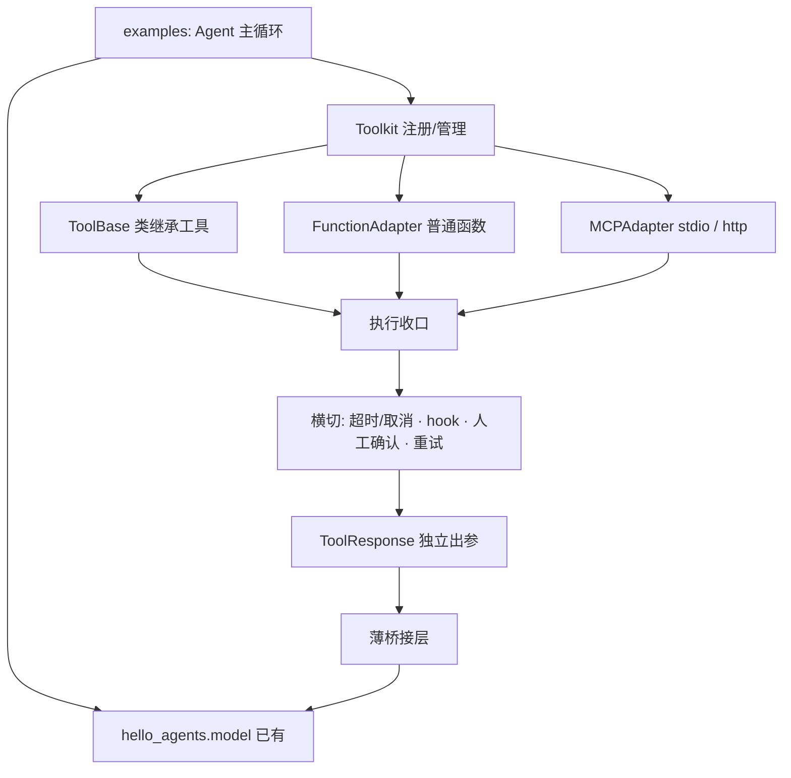

# Tool 子系统学习总览：从零设计你 Agent 的工具层

> 学习方式：对标 `D:\projects\agentscope\src\agentscope\tool`（只读学习，不修改），
> 在 `D:\projects\hello-agents` 内以**引导式**新建独立包 `hello_agents/tool/`，
> 最终经薄桥接层接入你已完成的 model 层，在 examples 里跑通"模型 + 工具"Agent。
> 旧 `hello_agents/tools/` 与 model 内 `_tool.py` 按约定不动、并存。

---

## 1. 目标与边界

**目标**：吃透并亲手实现一套可扩展的工具框架——

- 统一工具抽象（ToolBase）；
- 多来源适配：类继承、普通 Python 函数自动适配、MCP（stdio + 远程）；
- 统一执行收口：sync/async、超时、取消、异常不炸闭环；
- 横切治理：人工确认（human-in-the-loop）、调用前后 hook、工具层重试；
- 注册管理：Toolkit / ToolGroup；
- 代表性内置工具：read_file / write_file / bash / glob / grep；
- 薄桥接层：tool 的 ToolResponse ↔ model 的 Message/ToolResultBlock；
- examples：Agent 主循环（模型↔工具多轮闭环）。

**不做**：工具框架不内置 Agent 主循环（放 examples）；不做目录/命令沙箱（只靠人工确认）；
不重写旧代码；不做多模态工具。

---

## 2. 这层框架的价值（为什么不直接写几个函数）

1. **统一抽象**：Agent/模型只面对 ToolBase，不关心工具来自类、普通函数还是 MCP；
2. **schema 自动一致**：函数签名/类型注解 ↔ JSON Schema 自动生成，避免手写 schema 漂移；
3. **执行收口**：sync/async 统一 await、超时与取消一处处理，异常转结构化结果、闭环不断；
4. **横切治理**：危险操作人工确认、hook 审计、重试，全部在框架一处收口；
5. **注册管理**：Toolkit 统一注册/查找/分组/动态增删；
6. **解耦复用**：tool 包不依赖 model，经薄桥接可接入任意上层。

---

## 3. 架构



关键解耦点：**tool 包不 import model**；桥接层在二者之上，把 ToolResponse 转成
model 的 Message/ToolResultBlock。

---

## 4. 目录结构（计划）

```
hello_agents/tool/
  __init__.py
  _types.py            # ToolStatus 等枚举/基础类型
  _response.py         # ToolResponse（独立出参模型）
  _base.py             # ToolBase：元数据 + 统一调用入口
  _executor.py         # sync/async 统一执行、线程池、超时/取消
  _adapters.py         # 普通函数 → ToolBase
  _toolkit.py          # Toolkit / ToolGroup
  _governance.py       # hook、人工确认回调、工具层重试
  builtin/
    __init__.py
    _fs.py             # read_file / write_file
    _search.py         # glob / grep
    _bash.py           # bash（分步实现）
  mcp/
    __init__.py
    _config.py         # mcp_servers.yaml 加载（importlib.resources）
    _adapter.py        # MCP 工具 → ToolBase
    _stdio.py          # stdio 客户端
    _http.py           # streamable-http 客户端
    mcp_servers.yaml
docs/tool/             # 设计文档（本目录）
examples/tool_*.py     # 演示与端到端 Agent
tests/test_tool_*.py   # 测试
```

---

## 5. 里程碑路线（T0–T11）

| 里程碑 | 主题 | 关键产物 |
|---|---|---|
| T0 | 环境与包骨架 | `tool/` 目录、`uv add mcp`、占位文件、最小导入 |
| T1 | 出参模型 + ToolBase | ToolStatus、ToolResponse、ToolBase 元数据与统一入口 |
| T2 | 执行收口 | sync/async 统一、线程池、超时、取消、异常结构化 |
| T3 | 函数自动适配 | 类型注解 + docstring → JSON Schema（sync/async） |
| T4 | Toolkit / ToolGroup | 注册、查找、分组、动态增删 |
| T5 | 横切治理 | 前后 hook、人工确认回调、工具层重试（默认关，说明与 model 层关系） |
| T6 | 内置文件/搜索工具 | read_file / write_file / glob / grep |
| T7 | bash 工具 | 命令构造、最简解析、人工确认（分步，不一次性吞解析器） |
| T8 | MCP 接入（stdio） | mcp_servers.yaml、stdio 适配、uvx 真实 server |
| T9 | MCP 接入（远程） | 本地起 streamable-http server 再连 |
| T10 | 薄桥接层 | ToolResponse ↔ model Message/ToolResultBlock |
| T11 | 端到端整合 | examples Agent 主循环跑通"模型+工具"，复盘 |

> 顺序原则：先把 tool 包单独跑透（T1–T9），最后桥接整合（T10–T11）；
> 每个里程碑都遵循"我交付图纸 → 你实现 → 我 review → 通过"。

---

## 6. 协作约定（沿用 model 阶段）

- 我只交付：设计讲解文档、接口契约、留白任务、review；
- 你负责：代码、examples、tests（亲手写）；
- 凭据走 `.env` + python-dotenv；MCP 连接声明在 `mcp_servers.yaml`（只写 command/url，
  不写密钥本体）；
- 每个里程碑做最小自检 + ruff；能用离线/假对象测的就不依赖真实网络；
- 环境：Python 3.13、uv、虚拟环境 `.venv`。

---

## 7. 完成标准

- 能闭卷讲清工具框架的分层、多来源适配、执行收口与横切治理；
- 类继承 / 普通函数 / MCP 三类工具都能注册进 Toolkit 并被 Agent 调用；
- 危险工具经人工确认；工具失败转结构化错误、闭环不中断；
- examples 端到端跑通"模型 ↔ 工具"多轮闭环。

---

确认本总览与 T0–T11 路线无误后，我交付 **T0/T1 图纸**。若里程碑划分或目录结构
你想调整，直接指出。
